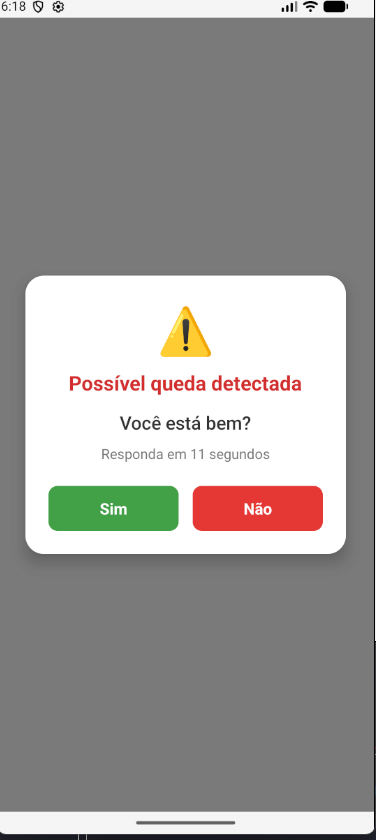
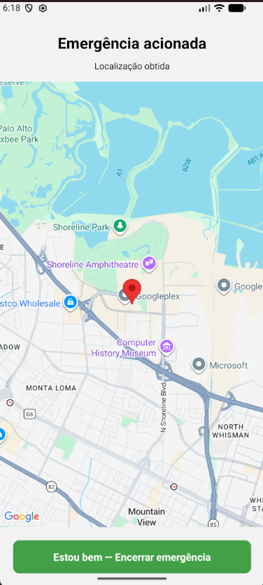

# projeto_hardware

## Projeto utilizando recursos de hardware — Grupo 5

### 2. Detector de Quedas 🚨

Um aplicativo para monitorar possíveis acidentes utilizando recursos de hardware do dispositivo.

O aplicativo detecta movimentos que possam indicar uma queda e solicita ao usuário uma confirmação. Caso o usuário não responda dentro do tempo determinado ou informe que não está bem, o aplicativo inicia o protocolo de emergência.

---

# Hardware utilizado

- Acelerômetro
- GPS
- Áudio

---

# Como funciona

O aplicativo permanece monitorando os movimentos do dispositivo através do acelerômetro.

Quando uma movimentação brusca que possa indicar uma queda é detectada, o aplicativo exibe um alerta:

> ⚠️ Possível queda detectada

> Você está bem?

**[Sim] [Não]**

### Se o usuário clicar em "Sim"

O alerta é encerrado e o aplicativo continua o monitoramento normalmente.

### Se o usuário clicar em "Não"

O aplicativo inicia o protocolo de emergência:

- obtém a localização atual através do GPS;
- exibe a localização em um mapa;
- reproduz o áudio de alerta.

### Se o usuário não responder em 10 segundos

O mesmo protocolo de emergência é iniciado automaticamente:

- obtém a localização atual;
- exibe a localização em um mapa;
- reproduz o áudio de alerta.

---
# Prints





---
# Estrutura de Pastas

```text
projeto_hardware/
├── assets/
│   └── alarm.mp3
│
└── src/
    ├── hardware/
    │   ├── accelerometer.js
    │   ├── gps.js
    │   └── audio.js
    │
    ├── services/
    │   ├── fall_detector.ts
    │   └── localization.ts
    │
    └── screens/
        ├── home_screen.js
        ├── alert_modal.js
        └── emergency_screen.js
